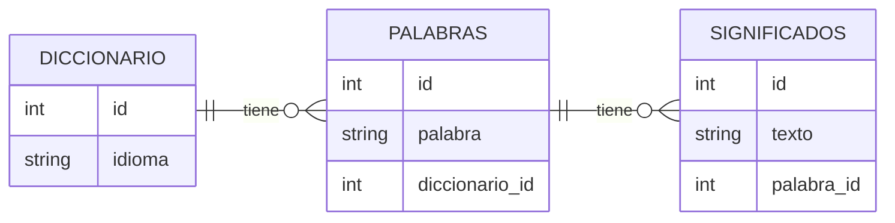

    TABLA: Diccionario

    Tabla: Palabras

    Tabla: Significados

        Diccionario < Palabras <         Significados
        id              id                id
        idioma          palabra           texto
                        diccionario_id    palabra_id


Mermaid es un lenguaje para escribir GRAFICOS y DIAGRAMAS.
Por ejemplo un diagrama entidad relación


Si yo usase JPA, me tocaría crear un script de BBDD del tipo:
```sql
CREATE TABLE diccionarios (
    id INT PRIMARY KEY AUTO_INCREMENT,
    idioma VARCHAR(20) NOT NULL UNIQUE
);
CREATE TABLE palabras (
    id INT PRIMARY KEY AUTO_INCREMENT,
    palabra VARCHAR(20) NOT NULL,
    diccionario_id INT NOT NULL,
    UNIQUE (palabra, diccionario_id),
    FOREIGN KEY (diccionario_id) REFERENCES diccionarios(id)
);
CREATE TABLE significados (
    id INT PRIMARY KEY AUTO_INCREMENT,
    texto VARCHAR(100) NOT NULL,
    palabra_id INT NOT NULL,
    FOREIGN KEY (palabra_id) REFERENCES palabras(id)
);
```

Ese script lo va a escribir en automático HIBERNATE, que es la implementación de JPA que vamos a usar. Pero si no queremos que Hibernate lo haga, podemos crear el script nosotros y decirle a Hibernate que no cree las tablas.

Prefiero no hacerlo. La gracia es que el fichero JAVA es la única fuente de verdad.
No quiero añadir una columna en el script de BBDD y que se me olvide añadirla en el fichero JAVA.
Ni quiero añadirla en el fichero JAVA y que se me olvide añadirla en el script de BBDD.

SOLO SE TRABAJA CON EL JAVA y el fichero de la bbdd se genera automáticamente. 

El SQL cambia de BBDD A BBDD
El SQL de Oracle no es el mismo que el de MySQL, ni el de PostgreSQL, ni el de SQL Server. Pero el fichero JAVA es el mismo para todas las BBDD.

HIBERNATE AJUSTARÁ ESE SQL A LA BBDD QUE ESTÉ USANDO.
Podré cambiar muy rápidamente de BBDD sin tener que tocar el código JAVA ni el script de BBDD.


Además de las entidades, necesitamos unas clases que nos ofrezcan las funciones para hacer:
- Insert
- Update
- Delete
- Select
En todas esas tablas.

Las entidades solo me han definido la estructura de las tablas, pero no me han definido las funciones para hacer esas operaciones.

Necesito poder hacer un DELETE de un idioma
O un:

select Count(*) from diccionarios where idioma = 'español';

Para saber si existe o no el idioma español en la tabla diccionarios.

Querre tener una función del tipo:

```java
Optional<Diccionario> findByIdioma(String idioma) // que me devuelva un objeto DiccionarioEnBD si existe el idioma, o null si no existe.
boolean existsByIdioma(String idioma) //que me devuelva true si existe el idioma, o false si no existe.
```

Esas funciones, para operar sobre las tablas las metemos en clases que denominamos REPOSITORIOS.
Y aquí Spring hace de nuevo mucha magia.
Porque hasta ahora no hemos usado nada de Spring en este proyecto.

Spring es capaz de generarme EL CODIGO DE ESOS REPOSITORIOS CREANDO EL SOLITO MAS DE 40 FUNCIONES PARA HACER LAS OPERACIONES TIPICAS SOBRE LAS TABLAS.
.save(IdiomaEnBD idioma) //insert o update
.delete(IdiomaEnBD idioma) //delete
.findById(Integer id) //select por id
.findAll() //select de todos los registros

Eso me lo regala Spring.

Además, me permite incluso de forma muy sencilla que yo defina funciones adicionales a esas 40.

// Buscame un diccionario por idioma(texto.. no por el id), pero además ignorando mayúsculas y minúsculas.

```java
    Optional<DiccionarioEnBD> findByIdiomaIgnoreCase(String idioma);
    boolean existsByIdiomaIgnoreCase(String idioma);
```                 ^^^^^^
                    Asi se llama el campo LITERALMENTE

Yo solo declararé la FIRMA de esa función usando una nomenclatura concreta, y Spring generará el código de esa función solito.

Spring da el código de esas funciones, hace la query a BBDD... se encarga de TODO!

Para ello, solo necesito crear una INTERFAZ que extienda de la interfaz JpaRepository de Spring.

```java
public interface DiccionarioRepository extends JpaRepository<DiccionarioEnBD,    Integer> {
                                                             ^^^^^^^^^^^^^^^     ^^^^^^^
                                                             Tipo de la entidad  Tipo del id de la entidad
}